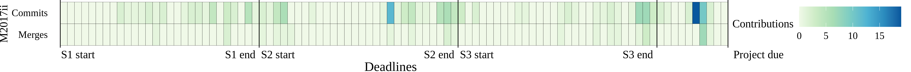
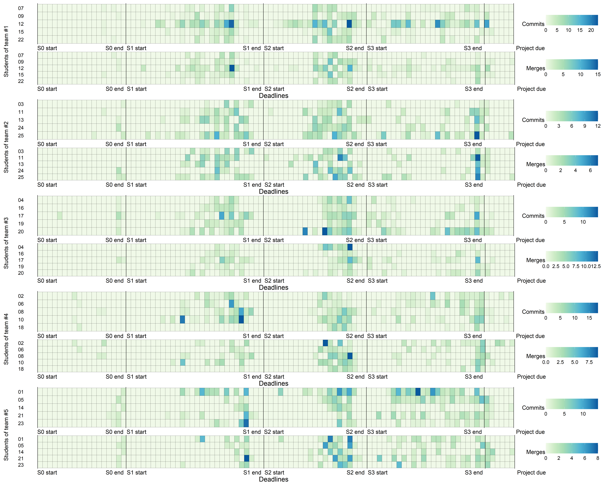

Measuring students’ contributions in software  development projects using Git metrics: Technical report
======

Table of contents
------
* [Course application development for mobile devices](#course-application-development-for-mobile-devices)
    * [Project M2017i](#project-m2017i)
    * [Project M2017ii](#project-m2017ii)
* [Course software engineering](#course-software-engineering)
    * [Project SE2018ii](#project-se2018ii)
    * [Project SE2019i](#project-se2019i)
    * [Project SE2019ii](#project-se2019ii)
* [Mixed courses](#mixed-courses)

## Course application development for mobile devices

### Project M2017i

#### Distribution of contributions

##### Developer-Project

|             | Min | 25Q  | Median | Mean | 75Q    | Max   | St. Dev |
|-------------|-----|------|--------|------|--------|-------|---------|
| **Commits** | 1   | 8.5  | 19     | 9.89 | 22.5   | 61    | 16.63   |
| **Merges**  | 0   | 0    | 2      | 4.37 | 6      | 18    | 5.20    |
| **Churn**   | 73  | 2551 | 7583   | 8608 | 11080  | 32074 | 8770.05 |

|                   | Commits  | Merges | Churn   |
|-------------------|----------|--------|---------|
| **Hoover index**  | 0.2985   | 0.4629 | 0.3593  |
| **Gini index**    | 0.4238   | 0.5961 | 0.4951  |
| **Theil index**   | 0.3023   | 0.2744 | 0.4237  |
| **20/20 ratio**   | 11.6250  | NA     | 16.5759 |
| **Palma ratio**   | 2.1273   | 7.7500 | 3.5971  |
| **50/50 ratio**   | 3.5632   | 9.6250 | 5.0448  |

##### Team-Project

|             | Min   | 25Q   | Median | Mean  | 75Q    | Max   | St. Dev  |
|-------------|-------|-------|--------|-------|--------|-------|----------|
| **Commits** | 47    | 47.75 | 90.5   | 94.5  | 137.25 | 150   | 54.71    |
| **Merges**  | 8     | 8.75  | 11.5   | 20.75 | 23.5   | 52    | 21       |
| **Churn**   | 27394 | 27618 | 39365  | 40886 | 52634  | 57421 | 15626.74 |

|                   | Commits | Merges | Churn  |
|-------------------|---------|--------|--------|
| **Hoover index**  | 0.2487  | 0.3886 | 0.1621 |
| **Gini index**    | 0.2540  | 0.4187 | 0.1724 |
| **Theil index**   | 0.1296  | 0.3431 | 0.0546 |
| **20/20 ratio**   | 3.0851  | 6.6250 | 2.0900 |
| **Palma ratio**   | 1.5263  | 3.1176 | 1.0362 |
| **50/50 ratio**   | 2.9789  | 3.8824 | 1.9599 |

##### Developer-Team

* **Team #1**

|             | Min    | 25Q    | Median | Mean   | 75Q    | Max    | St. Dev  |
|-------------|--------|--------|--------|--------|--------|--------|----------|
| **Commits** | 1      | 7      | 10     | 9.6    | 11     | 19     | 6.54     |
| **Merges**  | 0      | 2      | 2      | 1.8    | 2      | 3      | 1.1      |
| **Churn**   | 73     | 2156   | 2704   | 5479   | 9183   | 13278  | 5534.25  |

* **Team #2**

|             | Min    | 25Q    | Median | Mean   | 75Q    | Max    | St. Dev  |
|-------------|--------|--------|--------|--------|--------|--------|----------|
| **Commits** | 3      | 5      | 7      | 9.4    | 13     | 19     | 6.54     |
| **Merges**  | 0      | 0      | 0      | 1.6    | 2      | 6      | 2.61     |
| **Churn**   | 885    | 2191   | 2911   | 10208  | 12977  | 32074  | 13136.08 |

* **Team #3**

|             | Min    | 25Q    | Median | Mean   | 75Q    | Max    | St. Dev  |
|-------------|--------|--------|--------|--------|--------|--------|----------|
| **Commits** | 11     | 21     | 23     | 30     | 39     | 56     | 17.66    |
| **Merges**  | 0      | 0      | 3      | 2.8    | 5      | 6      | 2.77     |
| **Churn**   | 3928   | 7888   | 8340   | 11484  | 8912   | 28353  | 9631.81  |

* **Team #4**

|             | Min    | 25Q    | Median | Mean   | 75Q    | Max    | St. Dev  |
|-------------|--------|--------|--------|--------|--------|--------|----------|
| **Commits** | 20     | 21.5   | 26     | 33.25  | 37.75  | 61     | 19       |
| **Merges**  | 9      | 11.25  | 12.5   | 13     | 14.25  | 18     | 3.74     |
| **Churn**   | 2398   | 3210   | 5532   | 6923   | 9245   | 14230  | 5358.82  |

* **Team #1**

|                   | Commits  | Merges | Churn    |
|-------------------|----------|--------|----------|
| **Hoover index**  | 0.2333   | 0.2000 | 0.4199   |
| **Gini index**    | 0.3333   | 0.2667 | 0.4882   |
| **Theil index**   | 0.2167   | 0.0174 | 0.4476   |
| **20/20 ratio**   | 19.0000  |  NA    | 181.8904 |
| **Palma ratio**   | 2.3750   | 1.5000 | 5.9569   |
| **50/50 ratio**   | 2.2222   | 1.7500 | 5.1014   |

* **Team #2**

|                   | Commits | Merges | Churn   |
|-------------------|---------|--------|---------|
| **Hoover index**  | 0.2809  | 0.6000 | 0.4827  |
| **Gini index**    | 0.3404  | 0.7000 | 0.5734  |
| **Theil index**   | 0.1902  | 0.1308 | 0.6005  |
| **20/20 ratio**   | 6.3333  | NA     | 36.2418 |
| **Palma ratio**   | 2.3750  | NA     | 10.4272 |
| **50/50 ratio**   | 2.6000  | NA     | 8.0110  |

* **Team #3**

|                   | Commits | Merges | Churn  |
|-------------------|---------|--------|--------|
| **Hoover index**  | 0.2333  | 0.4000 | 0.2938 |
| **Gini index**    | 0.2880  | 0.4857 | 0.3474 |
| **Theil index**   | 0.1370  | 0.0377 | 0.2354 |
| **20/20 ratio**   | 5.0909  | NA     | 7.2182 |
| **Palma ratio**   | 1.7500  | NA     | 2.3995 |
| **50/50 ratio**   | 2.1455  | 4.6667 | 2.2626 |

* **Team #4**

|                   | Commits | Merges | Churn  |
|-------------------|---------|--------|--------|
| **Hoover index**  | 0.2086  | 0.0962 | 0.2877 |
| **Gini index**    | 0.2462  | 0.1346 | 0.3575 |
| **Theil index**   | 0.1104  | 0.0305 | 0.2169 |
| **20/20 ratio**   | 3.0500  | 2.0000 | 5.9341 |
| **Palma ratio**   | 1.4524  | 0.8571 | 2.4205 |
| **50/50 ratio**   | 2.1667  | 1.4762 | 3.7103 |

#### Distribution of contributions over time

##### Developer-Project

##### Team-Project

##### Developer-Team

### Project M2017ii

#### Distribution of contributions

##### Developer-Project

|             | Min | 25Q | Median | Mean | 75Q  | Max   | St. Dev |
|-------------|-----|-----|--------|------|------|-------|---------|
| **Commits** | 1   | 6   | 19     | 17   | 28   | 35    | 13.44     |
| **Merges**  | 0   | 1   | 1      | 3.22 | 5    | 8     | 3.03     |
| **Churn**   | 219 | 384 | 2614   | 8197 | 9031 | 45382 | 14429     |

|                   | Commits  | Merges  | Churn   |
|-------------------|----------|---------|---------|
| **Hoover index**  | 0.3333   | 0.4176  | 0.5385  |
| **Gini index**    | 0.4212   | 0.4751  | 0.6935  |
| **Theil index**   | 0.3303   | 0.3105  | 0.9422  |
| **20/20 ratio**   | 34.5000  | 15.0000 | 94.0306 |
| **Palma ratio**   | 2.0588   | 2.6667  | 21.8393 |
| **50/50 ratio**   | 3.7778   | 6.5000  | 15.2807 |

##### Team-Project

|             | Min   | 25Q   | Median | Mean  | 75Q   | Max   | St. Dev  18696.69|
|-------------|-------|-------|--------|-------|-------|-------|----------|
| **Commits** | 30    | 36    | 42     | 51    | 61.5  | 81    | 26.66    |
| **Merges**  | 6     | 6.5   | 7      | 9.667 | 11.5  | 16    | 5.51     |
| **Churn**   | 11383 | 13895 | 16407  | 24592 | 31196 | 45985 | 18696.69 |

|                   | Commits | Merges | Churn  |
|-------------------|---------|--------|--------|
| **Hoover index**  | 0.1961  | 0.2184 | 0.2900 |
| **Gini index**    | 0.2222  | 0.2299 | 0.3127 |
| **Theil index**   | 0.0876  | 0.1014 | 0.1813 |
| **20/20 ratio**   | 2.7000  | 2.6667 | 4.0398 |
| **Palma ratio**   | 1.1250  | 1.2308 | 1.6547 |
| **50/50 ratio**   | 1.7083  | 1.7692 | 2.2451 |

##### Developer-Team

* **Team #1**

|             | Min    | 25Q    | Median | Mean   | 75Q    | Max    | St. Dev  |
|-------------|--------|--------|--------|--------|--------|--------|----------|
| **Commits** | 1      | 5      | 9      | 10     | 14.5   | 20     | 9.54     |
| **Merges**  | 0      | 0.5    | 1      | 2      | 3      | 5      | 2.65     |
| **Churn**   | 369    | 737.5  | 1106   | 3794.3 | 5507   | 9908   | 5307.4   |

* **Team #2**

|             | Min    | 25Q    | Median | Mean    | 75Q    | Max    | St. Dev  |
|-------------|--------|--------|--------|---------|--------|--------|----------|
| **Commits** | 1      | 3.5    | 6      | 14      | 20.5   | 35     | 18.36    |
| **Merges**  | 1      | 1      | 1      | 2.333   | 3      | 5      | 2.31     |
| **Churn**   | 219    | 301.5  | 384    | 15328.3 | 22883  | 45382  | 26027.37 |

* **Team #3**

|             | Min    | 25Q    | Median | Mean   | 75Q    | Max    | St. Dev  |
|-------------|--------|--------|--------|--------|--------|--------|----------|
| **Commits** | 19     | 23.5   | 28     | 27     | 31     | 34     | 7.55     |
| **Merges**  | 1      | 4      | 7      | 5      | 7      | 8      | 3.79     |
| **Churn**   | 2614   | 3688   | 4762   | 5469   | 6896   | 9031   | 3266.4   |

* **Team #1**

|                   | Commits  | Merges | Churn   |
|-------------------|----------|--------|---------|
| **Hoover index**  | 0.3333   | 0.5000 | 0.5371  |
| **Gini index**    | 0.4222   | 0.5556 | 0.5587  |
| **Theil index**   | 0.3537   | 0.2426 | 0.6401  |
| **20/20 ratio**   | 20.0000  | NA     | 26.8509 |
| **Palma ratio**   | 2.0000   | 5.0000 | 6.7173  |
| **50/50 ratio**   | 2.9000   | 6.0000 | 7.4671  |

* **Team #2**

|                   | Commits  | Merges | Churn    |
|-------------------|----------|--------|----------|
| **Hoover index**  | 0.5000   | 0.3810 | 0.6536   |
| **Gini index**    | 0.5397   | 0.3810 | 0.6547   |
| **Theil index**   | 0.5797   | 0.3023 | 1.0202   |
| **20/20 ratio**   | 35.0000  | 5.0000 | 207.2237 |
| **Palma ratio**   | 5.0000   | 2.5000 | 75.2604  |
| **50/50 ratio**   | 5.8571   | 3.0000 | 75.8972  |

* **Team #3**

|                   | Commits  | Merges | Churn   |
|-------------------|----------|--------|---------|
| **Hoover index**  | 0.0988   | 0.2708 | 0.2171  |
| **Gini index**    | 0.1235   | 0.2917 | 0.2607  |
| **Theil index**   | 0.0269   | 0.2171 | 0.1183  |
| **20/20 ratio**   | 1.7895   | 8.0000 | 3.4549  |
| **Palma ratio**   | 0.7234   | 1.0000 | 1.2244  |
| **50/50 ratio**   | 1.3191   | 1.8750 | 1.8700  |

#### Distribution of contributions over time

##### Developer-Project

##### Team-Project

##### Developer-Team

## Course software engineering

### Project SE2018ii

#### Distribution of contributions

##### Developer-Project

|             | Min  | 25Q   | Median | Mean  | 75Q   | Max | St. Dev       |
|-------------|------|-------|--------|-------|-------|--------|----------|
| **Commits** | 32   | 59    | 79     | 94.84 | 99    | 375    | 70.17     |
| **Merges**  | 20   | 31    | 44     | 44.24 | 53    | 120    | 20.02     |
| **Churn**   | 2744 | 10122 | 50532  | 85284 | 73007 | 542473 | 135632.02 |

|                   | Commits  | Merges | Churn   |
|-------------------|----------|--------|---------|
| **Hoover index**  | 0.2266   | 0.1513 | 0.5041  |
| **Gini index**    | 0.3179   | 0.2147 | 0.6612  |
| **Theil index**   | 0.1918   | 0.0832 | 0.8257  |
| **20/20 ratio**   | 5.1179   | 2.8387 | 77.3301 |
| **Palma ratio**   | 1.4012   | 1.2535 | 16.8485 |
| **50/50 ratio**   | 2.2754   | 1.8186 | 12.3573 |

##### Team-Project

|             | Min    | 25Q    | Median | Mean   | 75Q    | Max    | St. Dev  |
|-------------|--------|--------|--------|--------|--------|--------|----------|
| **Commits** | 371    | 396    | 437    | 474.2  | 479    | 688    | 126.38   |
| **Merges**  | 190    | 202    | 206    | 221.2  | 221    | 286    | 37.89    |
| **Churn**   | 126044 | 144578 | 210824 | 426422 | 720227 | 930438 | 372994.3 |

|                   | Commits  | Merges | Churn   |
|-------------------|----------|--------|---------|
| **Hoover index**  | 0.0922   | 0.0586 | 0.3742  |
| **Gini index**    | 0.1210   | 0.0763 | 0.4098  |
| **Theil index**   | 0.0265   | 0.0111 | 0.3025  |
| **20/20 ratio**   | 1.8544   | 1.5053 | 7.3819  |
| **Palma ratio**   | 0.8970   | 0.7296 | 3.4381  |
| **50/50 ratio**   | 1.3322   | 1.1920 | 3.8665  |

##### Developer-Team

* **Team #1**

|             | Min    | 25Q    | Median | Mean   | 75Q    | Max    | St. Dev   |
|-------------|--------|--------|--------|--------|--------|--------|-----------|
| **Commits** | 70     | 79     | 80     | 137.6  | 84     | 375    | 132.81    |
| **Merges**  | 30     | 30     | 53     | 57.2   | 53     | 120    | 36.94     |
| **Churn**   | 10227  | 13682  | 66731  | 144045 | 191821 | 437766 | 179884.54 |

* **Team #2**

|             | Min    | 25Q    | Median | Mean   | 75Q    | Max    | St. Dev  |
|-------------|--------|--------|--------|--------|--------|--------|----------|
| **Commits** | 32     | 59     | 65     | 74.2   | 80     | 135    | 38.17    |
| **Merges**  | 31     | 33     | 35     | 41.4   | 53     | 55     | 11.61    |
| **Churn**   | 3912   | 4311   | 8704   | 28916  | 54644  | 73007  | 32577.13 |

* **Team #3**

|             | Min    | 25Q    | Median | Mean   | 75Q    | Max    | St. Dev  |
|-------------|--------|--------|--------|--------|--------|--------|----------|
| **Commits** | 37     | 48     | 59     | 79.2   | 103    | 149    | 46.37    |
| **Merges**  | 23     | 24     | 44     | 40.4   | 44     | 67     | 18.06    |
| **Churn**   | 3761   | 4686   | 10172  | 25209  | 16458  | 90967  | 37108.01 |

* **Team #4**

|             | Min    | 25Q    | Median | Mean   | 75Q    | Max    | St. Dev  |
|-------------|--------|--------|--------|--------|--------|--------|----------|
| **Commits** | 37     | 78     | 83     | 87.4   | 99     | 140    | 37.25    |
| **Merges**  | 20     | 27     | 46     | 38     | 47     | 50     | 13.55    |
| **Churn**   | 2744   | 71720  | 75241  | 186088 | 238260 | 542473 | 217206.3 |

* **Team #5**

|             | Min    | 25Q    | Median | Mean   | 75Q    | Max    | St. Dev  |
|-------------|--------|--------|--------|--------|--------|--------|----------|
| **Commits** | 41     | 68     | 75     | 95.8   | 96     | 199    | 60.95    |
| **Merges**  | 33     | 37     | 41     | 44.2   | 53     | 57     | 10.35    |
| **Churn**   | 10122  | 24093  | 50532  | 42165  | 60882  | 65195  | 24000.34 |

* **Team #1**

|                   | Commits  | Merges | Churn   |
|-------------------|----------|--------|---------|
| **Hoover index**  | 0.3451   | 0.2196 | 0.4742  |
| **Gini index**    | 0.3576   | 0.2839 | 0.5738  |
| **Theil index**   | 0.2907   | 0.1472 | 0.5983  |
| **20/20 ratio**   | 5.3571   | 4.0000 | 42.8049 |
| **Palma ratio**   | 2.5168   | 2.0000 | 18.3097 |
| **50/50 ratio**   | 2.3537   | 2.0000 | 7.6822  |

* **Team #2**

|                   | Commits  | Merges | Churn   |
|-------------------|----------|--------|---------|
| **Hoover index**  | 0.1795   | 0.1217 | 0.4829  |
| **Gini index**    | 0.2447   | 0.1314 | 0.5216  |
| **Theil index**   | 0.1018   | 0.0308 | 0.5251  |
| **20/20 ratio**   | 4.2188   | 1.7742 | 18.6623 |
| **Palma ratio**   | 1.4835   | 0.8594 | 8.8784  |
| **50/50 ratio**   | 1.7949   | 1.4444 | 8.0555  |

* **Team #3**

|                   | Commits  | Merges | Churn   |
|-------------------|----------|--------|---------|
| **Hoover index**  | 0.2364   | 0.1673 | 0.5217  |
| **Gini index**    | 0.2818   | 0.2139 | 0.5909  |
| **Theil index**   | 0.1305   | 0.0790 | 0.6779  |
| **20/20 ratio**   | 4.0270   | 2.9130 | 24.1869 |
| **Palma ratio**   | 1.7529   | 1.4255 | 10.7691 |
| **50/50 ratio**   | 2.1597   | 1.7033 | 6.3160  |

* **Team #4**

|                   | Commits  | Merges | Churn    |
|-------------------|----------|--------|----------|
| **Hoover index**  | 0.1469   | 0.1526 | 0.4391   |
| **Gini index**    | 0.2078   | 0.1684 | 0.5357   |
| **Theil index**   | 0.0763   | 0.0549 | 0.5279   |
| **20/20 ratio**   | 3.7838   | 2.5000 | 197.6942 |
| **Palma ratio**   | 1.2174   | 1.0638 | 7.2850   |
| **50/50 ratio**   | 1.6263   | 1.5376 | 5.7177   |

* **Team #5**

|                   | Commits  | Merges | Churn   |
|-------------------|----------|--------|---------|
| **Hoover index**  | 0.2159   | 0.0977 | 0.2377  |
| **Gini index**    | 0.2873   | 0.1158 | 0.2788  |
| **Theil index**   | 0.1445   | 0.0218 | 0.1518  |
| **20/20 ratio**   | 4.8537   | 1.7273 | 6.4409  |
| **Palma ratio**   | 1.8257   | 0.8143 | 1.9055  |
| **50/50 ratio**   | 2.0109   | 1.3604 | 2.0840  |

#### Distribution of contributions over time

##### Developer-Project

##### Team-Project

##### Developer-Team

### Project SE2019i

#### Distribution of contributions

##### Developer-Project

|             | Min  | 25Q  | Median | Mean  | 75Q   | Max   | St. Dev  |
|-------------|------|------|--------|-------|-------|-------|----------|
| **Commits** | 16   | 32   | 45     | 51.38 | 58    | 161   | 31.99    |
| **Merges**  | 7    | 19   | 21     | 27.48 | 33    | 90    | 17.58    |
| **Churn**   | 3519 | 8169 | 14753  | 24596 | 35873 | 87595 | 24112.04 |

|                   | Commits  | Merges | Churn   |
|-------------------|----------|--------|---------|
| **Hoover index**  | 0.2061   | 0.2092 | 0.3791  |
| **Gini index**    | 0.2888   | 0.2959 | 0.4914  |
| **Theil index**   | 0.1484   | 0.1569 | 0.3994  |
| **20/20 ratio**   | 3.5923   | 3.9683 | 14.9628 |
| **Palma ratio**   | 1.2890   | 3.5623 | 3.5623  |
| **50/50 ratio**   | 2.2754   | 2.2500 | 4.9638  |

##### Team-Project

|             | Min    | 25Q    | Median | Mean   | 75Q    | Max    | St. Dev  |
|-------------|--------|--------|--------|--------|--------|--------|----------|
| **Commits** | 167    | 194.8  | 258.5  | 269.8  | 333.5  | 395    | 103.99   |
| **Merges**  | 84     | 96.75  | 127.5  | 144.25 | 175    | 238    | 69.25    |
| **Churn**   | 54482  | 87626  | 139952 | 129130 | 181455 | 182134 | 63307.77 |

|                   | Commits  | Merges | Churn   |
|-------------------|----------|--------|---------|
| **Hoover index**  | 0.1562   | 0.1794 | 0.2035  |
| **Gini index**    | 0.1837   | 0.2231 | 0.2253  |
| **Theil index**   | 0.0557   | 0.0829 | 0.0978  |
| **20/20 ratio**   | 2.3653   | 2.8333 | 3.3430  |
| **Palma ratio**   | 1.0647   | 1.2865 | 1.1892  |
| **50/50 ratio**   | 1.9084   | 2.1189 | 2.3725  |

##### Developer-Team

* **Team #1**

|             | Min    | 25Q    | Median | Mean   | 75Q    | Max    | St. Dev  |
|-------------|--------|--------|--------|--------|--------|--------|----------|
| **Commits** | 27     | 31.5   | 45     | 56.43  | 49.5   | 161    | 47.04    |
| **Merges**  | 12     | 20.5   | 28     | 34     | 33.5   | 90     | 25.89    |
| **Churn**   | 4104   | 11274  | 16702  | 26019  | 25593  | 87595  | 28283.68 |

* **Team #2**

|             | Min    | 25Q    | Median | Mean   | 75Q    | Max    | St. Dev  |
|-------------|--------|--------|--------|--------|--------|--------|----------|
| **Commits** | 32     | 33     | 36     | 40.8   | 45     | 58     | 10.89    |
| **Merges**  | 13     | 14     | 21     | 20.2   | 25     | 28     | 6.61     |
| **Churn**   | 3612   | 8169   | 9141   | 10896  | 14753  | 18807  | 5937.88  |

* **Team #3**

|             | Min    | 25Q    | Median | Mean   | 75Q    | Max    | St. Dev  |
|-------------|--------|--------|--------|--------|--------|--------|----------|
| **Commits** | 16     | 24.25  | 42     | 41.75  | 41.75  | 67     | 24.16    |
| **Merges**  | 7      | 16     | 19     | 21     | 24     | 39     | 13.27    |
| **Churn**   | 3519   | 3742   | 8957   | 24668  | 29884  | 77241  | 35391.77 |

* **Team #4**

|             | Min    | 25Q    | Median | Mean   | 75Q    | Max    | St. Dev  |
|-------------|--------|--------|--------|--------|--------|--------|----------|
| **Commits** | 29     | 45     | 61     | 62.6   | 75     | 103    | 28.4     |
| **Merges**  | 17     | 21     | 29     | 30.8   | 38     | 49     | 12.97    |
| **Churn**   | 5324   | 35873  | 44325  | 36246  | 45981  | 49726  | 18014.3  |

* **Team #1**

|                   | Commits  | Merges | Churn   |
|-------------------|----------|--------|---------|
| **Hoover index**  | 0.2647   | 0.2353 | 0.3449  |
| **Gini index**    | 0.3313   | 0.3289 | 0.4636  |
| **Theil index**   | 0.2255   | 0.2015 | 0.3940  |
| **20/20 ratio**   | 3.6552   | 3.8750 | 7.6868  |
| **Palma ratio**   | 1.7889   | 1.6981 | 3.2867  |
| **50/50 ratio**   | 2.2593   | 2.2840 | 3.5864  |

* **Team #2**

|                   | Commits  | Merges | Churn   |
|-------------------|----------|--------|---------|
| **Hoover index**  | 0.1049   | 0.1327 | 0.2160  |
| **Gini index**    | 0.1255   | 0.1624 | 0.2715  |
| **Theil index**   | 0.0271   | 0.0438 | 0.1246  |
| **20/20 ratio**   | 1.8125   | 2.1538 | 5.2068  |
| **Palma ratio**   | 0.8923   | 1.0370 | 1.5964  |
| **50/50 ratio**   | 1.3762   | 1.5417 | 2.0410  |

* **Team #3**

|                   | Commits  | Merges | Churn   |
|-------------------|----------|--------|---------|
| **Hoover index**  | 0.2425   | 0.2143 | 0.5328  |
| **Gini index**    | 0.2740   | 0.2857 | 0.5864  |
| **Theil index**   | 0.1337   | 0.1506 | 0.6719  |
| **20/20 ratio**   | 4.1875   | 5.5714 | 21.9497 |
| **Palma ratio**   | 1.5581   | 1.5000 | 10.5305 |
| **50/50 ratio**   | 2.8837   | 2.2308 | 12.4525 |

* **Team #4**

|                   | Commits  | Merges | Churn   |
|-------------------|----------|--------|---------|
| **Hoover index**  | 0.1687   | 0.1649 | 0.1727  |
| **Gini index**    | 0.2275   | 0.2104 | 0.2183  |
| **Theil index**   | 0.0834   | 0.0704 | 0.1379  |
| **20/20 ratio**   | 3.5517   | 2.8824 | 9.3400  |
| **Palma ratio**   | 1.3919   | 1.2895 | 1.2070  |
| **50/50 ratio**   | 1.7704   | 1.7313 | 1.6374  |

#### Distribution of contributions over time

##### Developer-Project

##### Team-Project

##### Developer-Team

### Project SE2019ii

#### Distribution of contributions

##### Developer-Project

|             | Min  | 25Q   | Median | Mean   | 75Q    | Max    | St. Dev   |
|-------------|------|-------|--------|--------|--------|--------|-----------|
| **Commits** | 24   | 59.25 | 74.5   | 71.55  | 89.75  | 117    | 25.83     |
| **Merges**  | 9    | 31    | 42.5   | 41.1   | 51     | 82     | 18.38     |
| **Churn**   | 1394 | 18085 | 35121  | 116007 | 144694 | 742620 | 173484.79 |

|                   | Commits  | Merges | Churn   |
|-------------------|----------|--------|---------|
| **Hoover index**  | 0.1435   | 0.1629 | 0.4890  |
| **Gini index**    | 0.1991   | 0.2404 | 0.6337  |
| **Theil index**   | 0.0680   | 0.1038 | 0.7413  |
| **20/20 ratio**   | 3.2344   | 4.6140 | 41.8974 |
| **Palma ratio**   | 0.5967   | 0.7744 | 9.6032  |
| **50/50 ratio**   | 1.7949   | 1.9568 | 12.9952 |

##### Team-Project

|             | Min    | 25Q    | Median | Mean   | 75Q    | Max     | St. Dev   |
|-------------|--------|--------|--------|--------|--------|---------|-----------|
| **Commits** | 292    | 298    | 337    | 357.8  | 396.8  | 465     | 80.47     |
| **Merges**  | 150    | 158.2  | 181    | 205.5  | 228.2  | 310     | 73.03     |
| **Churn**   | 168457 | 296764 | 570180 | 580037 | 853454 | 1011330 | 392429.44 |

|                   | Commits  | Merges | Churn   |
|-------------------|----------|--------|---------|
| **Hoover index**  | 0.0863   | 0.1271 | 0.2811  |
| **Gini index**    | 0.1036   | 0.1582 | 0.3222  |
| **Theil index**   | 0.0185   | 0.0444 | 0.1855  |
| **20/20 ratio**   | 1.5925   | 2.0667 | 6.0035  |
| **Palma ratio**   | 0.7855   | 0.9968 | 1.9908  |
| **50/50 ratio**   | 1.4172   | 1.6431 | 3.5673  |

##### Developer-Team

* **Team #1**

|             | Min    | 25Q    | Median | Mean   | 75Q    | Max    | St. Dev  |
|-------------|--------|--------|--------|--------|--------|--------|----------|
| **Commits** | 41     | 65     | 82.5   | 75     | 92.5   | 94     | 24.56    |
| **Merges**  | 18     | 38.25  | 46     | 40.25  | 48     | 51     | 15.04    |
| **Churn**   | 5449   | 13183  | 19560  | 42114  | 48492  | 123887 | 55007.09 |

* **Team #2**

|             | Min    | 25Q    | Median | Mean   | 75Q    | Max    | St. Dev   |
|-------------|--------|--------|--------|--------|--------|--------|-----------|
| **Commits** | 33     | 62.25  | 79     | 73     | 89.75  | 101    | 29.18     |
| **Merges**  | 9      | 25.5   | 36     | 37.5   | 48     | 69     | 24.89     |
| **Churn**   | 18899  | 46029  | 124906 | 252832 | 331709 | 742620 | 335211.75 |

* **Team #3**

|             | Min    | 25Q    | Median | Mean   | 75Q    | Max    | St. Dev   |
|-------------|--------|--------|--------|--------|--------|--------|-----------|
| **Commits** | 24     | 38.25  | 63     | 62.33  | 73.5   | 117    | 33.82     |
| **Merges**  | 10     | 23.75  | 38     | 33.5   | 43.25  | 51     | 15.55     |
| **Churn**   | 1394   | 41621  | 120884 | 133471 | 193759 | 324415 | 122075.04 |

* **Team #4**

|             | Min    | 25Q    | Median | Mean   | 75Q    | Max    | St. Dev  |
|-------------|--------|--------|--------|--------|--------|--------|----------|
| **Commits** | 48     | 67.75  | 80.5   | 77.5   | 88     | 102    | 19.07    |
| **Merges**  | 31     | 42.25  | 47     | 51.67  | 58.5   | 82     | 17.91    |
| **Churn**   | 13197  | 18836  | 25946  | 56589  | 37026  | 217258 | 79264.45 |

* **Team #1**

|                   | Commits  | Merges | Churn   |
|-------------------|----------|--------|---------|
| **Hoover index**  | 0.1200   | 0.1382 | 0.4854  |
| **Gini index**    | 0.1483   | 0.1568 | 0.5386  |
| **Theil index**   | 0.0443   | 0.0615 | 0.5537  |
| **20/20 ratio**   | 2.2927   | 2.8333 | 22.7357 |
| **Palma ratio**   | 0.8246   | 0.8095 | 5.8410  |
| **50/50 ratio**   | 1.6316   | 1.5556 | 6.9423  |

* **Team #2**

|                   | Commits  | Merges | Churn   |
|-------------------|----------|--------|---------|
| **Hoover index**  | 0.1404   | 0.2333 | 0.4843  |
| **Gini index**    | 0.1866   | 0.3167 | 0.5712  |
| **Theil index**   | 0.0674   | 0.1799 | 0.6094  |
| **20/20 ratio**   | 3.0606   | 7.6667 | 39.2941 |
| **Palma ratio**   | 0.9619   | 1.7250 | 10.0393 |
| **50/50 ratio**   | 1.7810   | 2.7500 | 12.6720 |

* **Team #3**

|                   | Commits  | Merges | Churn   |
|-------------------|----------|--------|---------|
| **Hoover index**  | 0.1889   | 0.1841 | 0.3411  |
| **Gini index**    | 0.2701   | 0.2347 | 0.4628  |
| **Theil index**   | 0.1242   | 0.1037 | 0.4072  |
| **20/20 ratio**   | 3.5926   | 3.1667 | 28.4707 |
| **Palma ratio**   | 1.0000   | 0.7846 | 2.4442  |
| **50/50 ratio**   | 2.1966   | 2.0923 | 5.0337  |

* **Team #4**

|                   | Commits  | Merges | Churn   |
|-------------------|----------|--------|---------|
| **Hoover index**  | 0.0935   | 0.1280 | 0.4732  |
| **Gini index**    | 0.1258   | 0.1720 | 0.5366  |
| **Theil index**   | 0.0264   | 0.0481 | 0.5846  |
| **20/20 ratio**   | 1.6903   | 1.9589 | 8.1454  |
| **Palma ratio**   | 0.5397   | 0.7069 | 4.1754  |
| **50/50 ratio**   | 1.4603   | 1.6724 | 5.5253  |

#### Distribution of contributions over time

##### Developer-Project

##### Team-Project

##### Developer-Team

Mixed courses
------

##### Developer-Project

##### Team-Project
